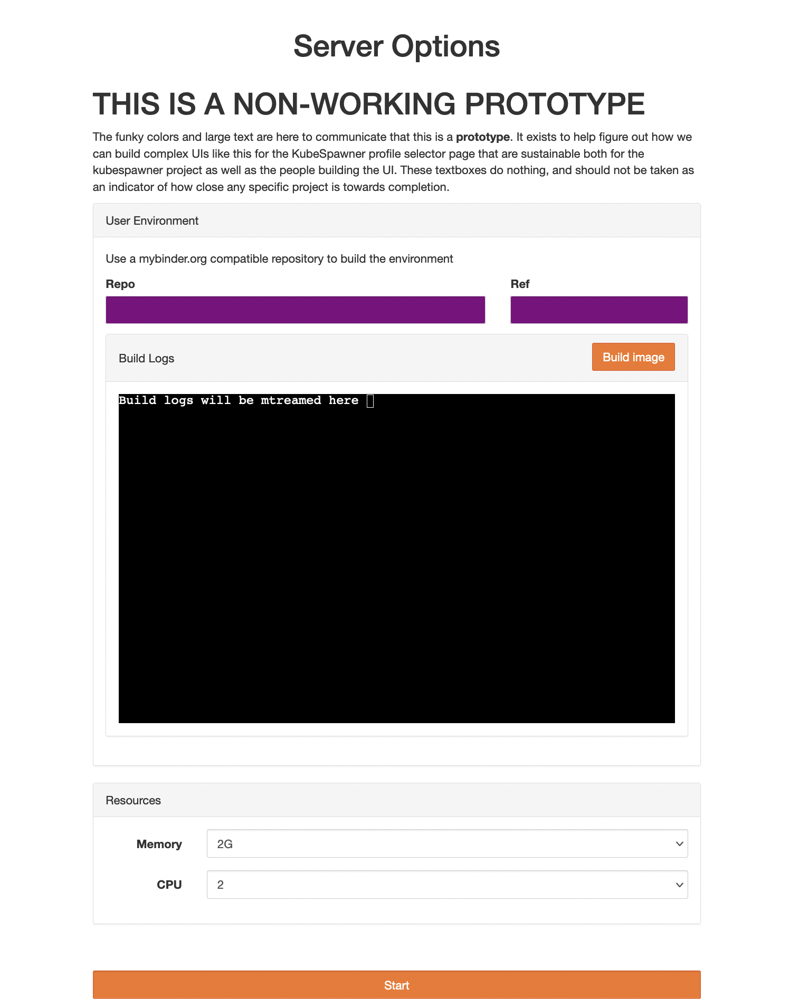

# `jupyterhub-fancy-profiles`

A react based, fancy implementation of user selectable profiles
for use with [jupyterhub-kubespawner](https://github.com/jupyterhub/kubespawner).



## Features

1. Interpret a `profileList` given to kubespawner, and render a better looking
   and more featureful selector. This includes descriptions for various options,
   as well as better descriptions for allowing users to 'write-in' a choice.

2. If enabled, interact with a [binderhub](https://github.com/jupyterhub/binderhub/)
   deployed as a JupyterHub service to allow users to _dynamically_ build images
   they want to use, without requiring it to be pre-built.

## Limitations

1. While multiple `profile_options` are supported, only a single `profile` is
   supported.

2. The forms values don't remember their previous state upon refresh

## How to use

### Using with z2jh

This package can be used with any installation of KubeSpawner, but is most
commonly used with an installation of z2jh. It requires installing `jupyterhub-fancy-profiles`
in the `hub` image used by z2jh.

As a convenience, we build and push docker images that can be automatically
used with z2jh!

1. Look at the [list of available tags](https://quay.io/repository/yuvipanda/z2jh-hub-with-fancy-profiles?tab=tags)
   and find a tag that matches the version of z2jh you are using.

2. Use this image in the z2jh config. In the `values.yaml` file you pass to
   `helm`, use the following:

   ```yaml
   hub:
     image:
       name: quay.io/yuvipanda/z2jh-hub-with-fancy-profiles
       tag: <tag-from-the-list>
     extraConfig:
       01-enable-fancy-profiles: |
         from jupyterhub_fancy_profiles import setup_ui
         setup_ui(c)
   ```

3. Run a `helm upgrade` and you should have fancy profiles enabled!

### Using directly with KubeSpawner

After the package is installed, you can have kubespawner use the templates shipped
with this package to provide appropriate UI, by adding the following snippet
to your `jupyterhub_config.py` file:

```python
from jupyterhub_fancy_profiles import setup_ui
setup_ui(c)
```

The `setup_ui` function will setup all the appropriate config as needed. Currently,
it will:

1. Setup extra templates to be made available to kubespawner, to render the
   base HTML for `profile_list`.
2. Setup extra HTTP handlers, primarily for serving our static assets.

## What is in here?

The primary contents are:

1. `jupyterhub_fancy_profiles/templates` contains jinja2 templates, primarily
   `HTML` for constructing the form itself. This can contain multiple templates
   that are composed together using all of jinja2's composition features (like `include`)
2. `src/` contains JS and CSS that are packaged via standard frontend bundling
   tools (`webpack` and `babel`), outputing assets into `jupyterhub_fancy_profiles/static/`.
   This allows us to use _standard_ frontend tooling to write JS & CSS - for
   example, [xterm.js](http://xtermjs.org/) can be used without many complications.

## Why React?

> /\* If this file gets over 200 lines of code long (not counting docs / comments), start using a framework

(from the [BinderHub JS Source Code](https://github.com/jupyterhub/binderhub/blob/036877ffdf0abfde7e84f3972c7d0478cf4f7cb2/binderhub/static/js/index.js#L1))

Dear Reader, the file _did_ get more than 200 lines long, but alas there was no
time to start using a framework. Lesson learnt from that is we should use a
_very lightweight_ framework right from the start, something mainstream that
can attract frontend devs without being so fancy that nobody else can work on
it. Given the size and complexity of this - a complex UI but only a single page -
plain react without typescript seems the correct choice. We will _not_ make
this into a super-heavy, complex application - just a fairly simple one that
uses react.

## Making a Release

We have [automation](https://github.com/pypa/gh-action-pypi-publish/)
set up to make releases to [PyPI](https://pypi.org/project/jupyterhub-fancy-profiles/).
We should release early and often!

1. On your local checkout, make sure you are up to date with the `main` branch

   ```bash
   git checkout main
   git stash
   git pull upstream main # or git pull origin main, as needed
   ```

2. Create a new git tag, with the version of the release.

   ```bash
   git tag -a v<version-number>
   ```

   Leave a simple message here. While ideally a changelog would also be nice,
   at a minimum simply say `Version <version-number>`

3. Push your tag to GitHub

   ```bash
   git push origin --tags
   ```

4. That's it! A new release should be on PyPI shortly.

## Comparisons to the BinderHub UI

The BinderHub project provides a frontend that also allows end users to
build images and launch them. How do you determine when to use that UI
vs `jupyterhub-fancy-profiles` (with Dynamic Image Building integration)?

This project is still young, and these guidelines may change over time.

The _primary_ question is one of _intent_.

Are you building a _persistent JupyterHub_ with many functions (persistent home
directories, multiple profiles for images, resource requirements, strong access
control, etc) that
_also_ happens to need a way for users to dynamically build their own images?
Then use `jupyterhub-fancy-profiles` with BinderHub integration.

Are you building an _ephemeral JupyterHub_ where users may click a link and that
immediately puts them in an _ephemeral_ interactive compute session with
a particular environment and particular content? Use the BinderHub UI.

A useful rubric here is to look for persistent home directory storage. If your
users want that, you probably want to use `jupyterhub-fancy-profiles` with
BinderHub integration. If not, the BinderHub UI is more likely to be used.

## Funding

Funded in part by [GESIS](http://notebooks.gesis.org) in cooperation with
NFDI4DS [460234259](https://gepris.dfg.de/gepris/projekt/460234259?context=projekt&task=showDetail&id=460234259&)
and [CESSDA](https://www.cessda.eu).
